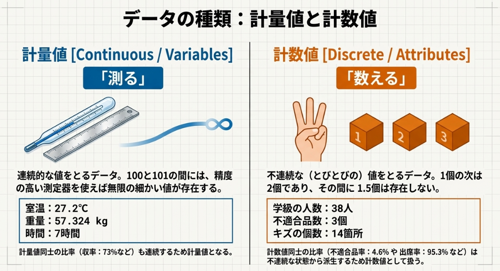

# 【完全保存版】データの種類をゼロから理解する！データを分類しよう！

---
##　はじめに：「なんとなくわかる」から「使える」へ

ビックデータという言葉が浸透した昨今、「データを活用」といってもデータってそもそも何ですか？と考えたことはありませんか？データと一口にいっても数値、言葉、画像、動画、音声、、、、など様々な形があります。データという言葉きちんと体系的に整理して、自分の業種や業界がどのようなデータを使うのかきちんて整理しておきましょう。

### 1. データの種類：計量値と計数値の定義

品質管理において取り扱う代表的な数値データは、大きく**計量値**と**計数値**の2種類に分類されます。
。データの種類によって適用すべき統計的手法が異なるため、両者の区別は非常に重要です
。
① 計量値（連続的なデータ）
計量値とは、はかる（量る、測る）ことによって得られる数値データであり、連続的な値をとる性質を持ちます
。通常の測定器よりも精度の高い機器を用いれば、より細かく正確な値（小数点以下の連続した数値）が得られるのが特徴です
。
具体例：重量、長さ（寸法）、温度、時間などです
。
② 計数値（非連続なデータ）
計数値とは、数えることによって得られる数値データであり、非連続（離散的）な値をとる性質を持ちます
。例えば「4人の次は5人」であり、その中間の値（4.5人など）は存在しません
。
具体例：人数、個数、不適合品数（不良品数）、キズの発生箇所数、故障回数などです
。

---
2. 業界別のデータ具体例
データの分類をより身近なものとして理解するため、製造業、介護業界、サービス業界の各現場における計量値と計数値の具体例を以下に提示します。
🏭 製造業における事例
計量値：加工された部品の長さや厚み（mm）、製品の重量（g）、機械の稼働時間や設定温度（℃）です
。
計数値：生産ラインで発生した不適合品の数（個）、製品表面のキズの数（箇所）です
。
👵 介護業界における事例
計量値：利用者の体温（℃）や血圧の数値、リハビリテーションの実施時間（分）です。
計数値：施設内における転倒事故の発生件数（件）、日々のレクリエーション参加人数や欠席者数（人）です。
🍽️ サービス業界（飲食店・ホテル等）における事例
計量値：顧客が注文してから料理が提供されるまでの待ち時間（分）、提供されるスープの温度（℃）です。
計数値：1日あたりの来店客数（人）、顧客からの苦情・クレームの件数（件）です
。

---
3. データの取り方・まとめ方の基本原則
[図解イラスト挿入：現場でバインダーを持ち観察する調査員と、集めたデータを棒グラフや円グラフに変換するプロセス図]
データを無計画に収集しても問題解決には繋がりません。事実を正確に把握し、改善活動に結びつけるためには、以下の基本原則に従ってデータを取得・整理する必要があります。
① データ収集の目的を明確にする
データをとる行為は、母集団に関する情報を得て何らかの処置をとるために行われます
。したがって、データ収集に先立ち、「何のためにデータをとるのか」という使用目的（現状把握、原因解析、工程の管理など）を明確にしておくことが不可欠です
。
② 三現主義と5W1Hに基づく記録
事実を観察する際は、「現場」に行き、「現物」を確認し、「現実」を見るという「三現主義」の姿勢が基本となります
。そして、ありのままの事実を記録する過程では、「5W1H（When：いつ、Where：どこで、Who：誰が、What：何を、Why：なぜ、How：どのように）」の各要素に抜けがないかを心がけ、チェックシート等に正確に記録することが重要です
。
③ データの視覚化と層別
数値の羅列だけでは全体像の把握が困難であるため、収集したデータを「見える形」に変換する処理が求められます
。
図示する（グラフ化）：データをヒストグラムやパレート図、折れ線グラフなどの図形として表すことで、数量の大小や時間的な変化を視覚的にわかりやすくします
。
特徴・違いを浮き立たせる（層別）：機械別、作業者別、時間帯別など、データが持つ履歴や特徴ごとにグループ（層）に分割して比較することを「層別」といいます
。これにより、ばらつきの真の原因を究明する手がかりを得ることができます
。

---
4. 【QC検定対策】「データの種類」頻出出題パターン
[図解イラスト挿入：試験用紙に向かって熟考する人物と、ヒントとして提示される「測るか、数えるか」の天秤のイラスト]
QC検定4級において、「データの種類」に関する分野では、与えられた具体例が「計量値」と「計数値」のどちらに該当するかを判別させる問題が頻出します
。
📝 模擬問題 次の各々の文章において、計量値には「ア」、計数値には「イ」を選択してください。
人間の体温（単位：℃）
毎日の欠席者数（単位：人）
製品の重量（単位：g）
製品のキズの箇所（単位：箇所）
通勤時間（単位：分）
💡 解答と解説
ア（計量値）：温度は温度計によって「はかる」連続的なデータです
。
イ（計数値）：人数は「数える」ことによって得られる非連続なデータです
。
ア（計量値）：重量ははかりによって「量る」連続的なデータです
。
イ（計数値）：キズの数は1箇所、2箇所と「数える」データです
。
ア（計量値）：時間は時計等で「測る」連続的なデータです
。
【プロからの学習アドバイス】 判別に迷った際は、「そのデータが小数点以下の連続した値をとり得るか」を基準に考察するとよいでしょう
。例えば「36.5℃」や「45.5分」は物理的に存在し得る連続量ですが、「1.5人の欠席」という状態は存在しないため、非連続な計数値であると論理的に導き出すことが可能です
。

---
まとめ
品質管理の根幹をなす「事実に基づく判断」を実践するためには、データの性質を正しく理解し、客観的な観測に基づくデータの収集と処理を行うことが求められます
。
計量値と計数値の定義を明確に区別することです
。
データ取得時は目的の明確化と5W1Hに基づく記録を徹底することです
。
収集したデータは、グラフ化や層別によって視覚的かつ分析可能な状態に加工することです
。
これらの理論は、製造現場のみならず、サービス業や医療・福祉などあらゆるプロセスの改善に適用できる普遍的な知識です
。本稿の内容を反復学習し、QC検定合格および現場での実践に役立てることを期待します。