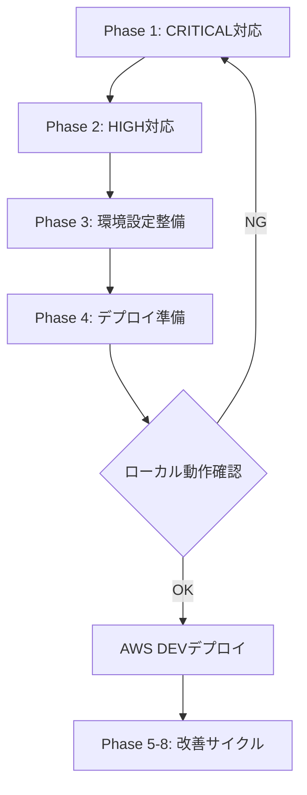

# AWS DEV環境構築前 ローカルチェックリスト

**目的**: AWS DEV環境にデプロイする前に、ローカル環境でセキュリティ・品質・デプロイ準備を完了させる

**作成日**: 2026-02-17
**参照**: [security-todo.md](./security-todo.md), [aws-deploy-simple.md](./aws-deploy-simple.md)

---

## 🚨 Phase 1: CRITICAL セキュリティ対応（必須・最優先）

### 1.1 環境変数の完全分離 ⚠️

- [ ] **DBパスワードのハードコード削除**
  - ファイル: `config/mysql.config.js:5`
  - 現状: `PASSWORD: process.env.MYSQL_PASSWORD || "i2679nm3328"`
  - 対応: フォールバック値を削除、環境変数必須化
  ```js
  PASSWORD: process.env.MYSQL_PASSWORD || (() => { throw new Error('MYSQL_PASSWORD is required') })()
  ```

- [ ] **SESSION_SECRET の検証強化**
  - ファイル: `config/application.config.js`
  - 対応: 起動時に長さチェック追加（64文字以上）
  ```js
  if (!process.env.SESSION_SECRET || process.env.SESSION_SECRET.length < 64) {
    throw new Error('SESSION_SECRET must be at least 64 characters');
  }
  ```

- [ ] **.env.example の作成**
  - すべての必須環境変数をドキュメント化
  - ダミー値は `CHANGEME` 等のプレースホルダ使用
  - 必須/オプションを明記

### 1.2 XSS 対策 ⚠️

- [ ] **Stored XSS の修正**
  - ファイル: `views/questions/question.ejs:67`
  - 対応: `<%- choice.text %>` → `<%= choice.text %>` に変更
  - テスト: スクリプトタグを含むテストデータで動作確認

### 1.3 CSRF 対策 ⚠️

- [ ] **セッションCookie属性の追加**
  - ファイル: `app.js:43-47`
  - 対応: `sameSite: 'lax'` を追加
  ```js
  cookie: {
    httpOnly: true,
    secure: process.env.NODE_ENV === 'production',
    sameSite: 'lax',
    maxAge: 24 * 60 * 60 * 1000  // 24時間
  }
  ```

- [ ] **JSON APIの Origin/Referer 検証**
  - 対象: `/tools/api/*` エンドポイント
  - ミドルウェア実装: `lib/middleware/csrf-check.js`
  ```js
  // 例: express-rate-limit と同様に実装
  function checkOrigin(req, res, next) {
    const origin = req.get('Origin') || req.get('Referer');
    const allowedOrigins = [process.env.APP_URL];
    // 検証ロジック
  }
  ```

### 1.4 MySQL接続のセキュア化 ⚠️

- [ ] **insecureAuth の削除**
  - ファイル: `app.js:34`
  - 対応: `insecureAuth: true` の行を削除
  - RDS接続確認: `caching_sha2_password` 対応確認

---

## 🔐 Phase 2: HIGH セキュリティ対応（必須）

### 2.1 セッション管理の強化

- [ ] **Session Fixation 対策**
  - ファイル: `routes/auth.js:18`
  - 対応: ログイン成功時に `req.session.regenerate()` を実行
  ```js
  req.logIn(user, (err) => {
    if (err) return next(err);
    req.session.regenerate((err) => {
      if (err) return next(err);
      res.json({ success: true });
    });
  });
  ```

### 2.2 レート制限の実装

- [ ] **認証エンドポイントへのレート制限追加**
  - パッケージは既にインストール済み: `express-rate-limit`
  - 対象:
    - `POST /auth/login`: 5回/分
    - `POST /auth/register`: 3回/時
  - ファイル: `routes/auth.js`
  ```js
  const rateLimit = require('express-rate-limit');
  const loginLimiter = rateLimit({
    windowMs: 60 * 1000,
    max: 5,
    message: 'ログイン試行回数が上限に達しました。1分後に再試行してください。'
  });
  router.post('/login', loginLimiter, passport.authenticate(...));
  ```

### 2.3 セキュリティヘッダーの追加

- [ ] **Helmet の導入**
  - インストール: `npm install helmet`
  - ファイル: `app.js`
  ```js
  const helmet = require('helmet');
  app.use(helmet({
    contentSecurityPolicy: {
      directives: {
        defaultSrc: ["'self'"],
        scriptSrc: ["'self'", "'unsafe-inline'", "cdn.jsdelivr.net"],  // KaTeX用
        styleSrc: ["'self'", "'unsafe-inline'", "cdn.jsdelivr.net"]
      }
    }
  }));
  ```

---

## 📝 Phase 3: 環境設定ファイルの整備（必須）

### 3.1 .env.example の作成

- [ ] **テンプレートファイル作成**
  ```env
  # Application
  NODE_ENV=development
  PORT=3000
  APP_URL=http://localhost:3000

  # Database
  MYSQL_HOST=localhost
  MYSQL_PORT=3306
  MYSQL_USERNAME=root
  MYSQL_PASSWORD=CHANGEME
  MYSQL_DATABASE=qc_portal
  MYSQL_CONNECTION_LIMIT=10

  # Session
  SESSION_SECRET=CHANGEME_minimum_64_characters_random_string_here_CHANGEME

  # AWS (Optional for production)
  # AWS_REGION=ap-northeast-1
  # AWS_ACCESS_KEY_ID=
  # AWS_SECRET_ACCESS_KEY=
  ```

### 3.2 .gitignore の確認

- [ ] **.gitignore に追加**
  ```
  .env
  .env.local
  .env.production
  nul
  ```

### 3.3 環境変数チェックスクリプト

- [ ] **scripts/check-env.js の作成**
  ```js
  // 起動時に環境変数を検証
  const required = ['MYSQL_PASSWORD', 'SESSION_SECRET', 'MYSQL_HOST'];
  const missing = required.filter(key => !process.env[key]);
  if (missing.length > 0) {
    console.error('Missing required environment variables:', missing);
    process.exit(1);
  }
  ```

- [ ] **app.js で読み込み**
  ```js
  require('dotenv').config();
  require('./scripts/check-env');
  ```

---

## 🛠️ Phase 4: デプロイ準備（必須）

### 4.1 package.json の整備

- [ ] **npm scripts の追加**
  ```json
  "scripts": {
    "start": "node app.js",
    "dev": "NODE_ENV=development node app.js",
    "prod": "NODE_ENV=production node app.js",
    "check-env": "node scripts/check-env.js",
    "test": "echo \"Error: no test specified\" && exit 1"
  }
  ```

### 4.2 データベーススキーマ管理

- [ ] **スキーマエクスポート**
  ```bash
  # ローカルDBからスキーマのみダンプ
  mysqldump -u root -p --no-data qc_portal > data/schema.sql
  ```

- [ ] **初期データのエクスポート（必要に応じて）**
  ```bash
  # 問題データなど、必要なマスターデータのみ
  mysqldump -u root -p qc_portal questions categories > data/initial-data.sql
  ```

### 4.3 README.md の更新

- [ ] **セットアップ手順の追記**
  - 環境変数の設定方法
  - データベースの初期化手順
  - ローカル起動コマンド

---

## ✅ Phase 5: コード品質（推奨・時間があれば）

### 5.1 入力検証の追加

- [ ] **question_id のバリデーション**
  - ファイル: `routes/account.js:193`
  ```js
  const questionId = parseInt(req.params.question_id, 10);
  if (isNaN(questionId) || questionId <= 0) {
    return res.status(400).json({ error: 'Invalid question ID' });
  }
  ```

### 5.2 デバッグログの整理

- [ ] **console.log の削除または環境変数制御**
  - ファイル: `routes/question_start.js`, `routes/question_select.js`
  ```js
  if (process.env.NODE_ENV === 'development') {
    console.log('[DEBUG]', data);
  }
  ```

### 5.3 エラーハンドリングの統一

- [ ] **グローバルエラーハンドラーの実装**
  - ファイル: `app.js` 末尾
  ```js
  app.use((err, req, res, next) => {
    console.error(err.stack);
    res.status(err.status || 500).json({
      error: process.env.NODE_ENV === 'production'
        ? 'Internal Server Error'
        : err.message
    });
  });
  ```

---

## 📚 Phase 6: ドキュメント整備（推奨）

### 6.1 APIドキュメント

- [ ] **docs/api-reference.md の作成**
  - `/tools/api/*` エンドポイントの仕様
  - リクエスト/レスポンス例
  - エラーコード一覧

### 6.2 アーキテクチャドキュメント更新

- [ ] **docs/architecture.md の確認**
  - セキュリティ対応後の変更点を反映
  - 環境変数一覧を追記

---

## 🧪 Phase 7: テスト（任意・DEV環境後でも可）

### 7.1 基本的なテスト準備

- [ ] **テストフレームワーク検討**
  - Jest または Mocha + Chai
  - Supertest (API テスト)

- [ ] **優先度高のテスト**
  - 認証フロー (login, register, logout)
  - CSRF保護の動作確認
  - レート制限の動作確認

---

## ✨ Phase 8: パフォーマンス最適化（任意・DEV環境後でも可）

### 8.1 静的ファイルのキャッシュ設定

- [ ] **Express静的ファイルミドルウェア設定**
  ```js
  app.use('/public', express.static('public', {
    maxAge: '1d',  // 1日キャッシュ
    etag: true
  }));
  ```

### 8.2 画像最適化の検討

- [ ] **longblob画像の最適化戦略**
  - WebP変換の検討
  - 遅延読み込みの実装

---

## 📋 デプロイ前最終チェック

### Phase 1 完了確認
- [ ] すべてのCRITICALセキュリティ問題を解決
- [ ] .env.exampleが完全
- [ ] ローカルで `NODE_ENV=production npm start` が成功

### Phase 2 完了確認
- [ ] すべてのHIGHセキュリティ問題を解決
- [ ] helmetが正しく動作

### Phase 3 完了確認
- [ ] .env.example から .env をコピーして起動可能
- [ ] 環境変数チェックスクリプトが動作

### Phase 4 完了確認
- [ ] schema.sql でDBが再構築可能
- [ ] README.mdに初期設定手順が記載

### 最終確認
- [ ] `git status` でハードコードされた秘密情報が含まれていないか確認
- [ ] .gitignore が .env をカバーしているか確認
- [ ] リモートリポジトリにpushする前に機密情報をgrepで検索
  ```bash
  git grep -i "password\|secret" -- ':!docs/' ':!*.md'
  ```

---

## 推奨作業順序



**所要時間見積もり**:
- Phase 1: 2-3時間
- Phase 2: 1-2時間
- Phase 3: 30分
- Phase 4: 1時間
- **合計**: 4.5-6.5時間（Phase 1-4のみ）

---

## 次のステップ

✅ このチェックリスト完了後 → [aws-deploy-simple.md](./aws-deploy-simple.md) に従ってAWS DEV環境構築

🔄 DEV環境でテスト後 → Phase 5-8を段階的に実装
